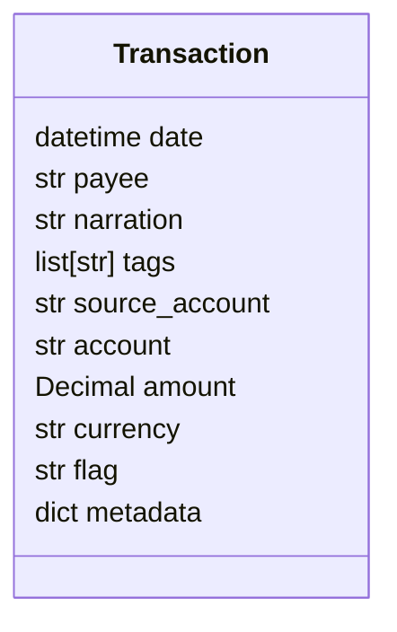
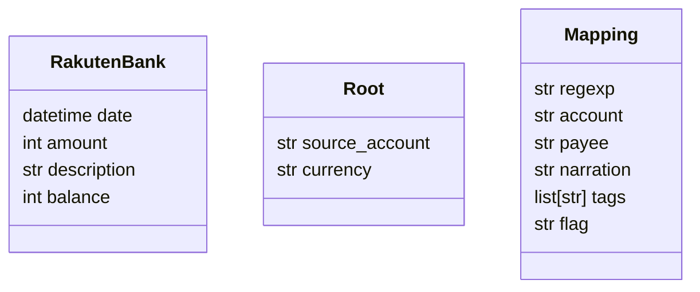

# Data Model

## Beancount transaction


```mermaid
classDiagram
    class Transaction{
        datetime date
        str payee
        str narration
        list[str] tags
        str source_account
        str account
        Decimal amount
        str currency
        str flag
        dict metadata
    }
```


## Rakuten Bank

CSV header row:

```csv
取引日,入出金(円),取引後残高(円),入出金内容
```

In English:

```csv
date,amount,description,balance
```



```mermaid
classDiagram
    class RakutenBank{
        datetime date
        int amount
        str description
        int balance
    }

    class Root{
        str source_account
        str currency
    }

    class Mapping{
        str regexp
        str account
        str payee
        str narration
        list[str] tags
        str flag
    }
```
